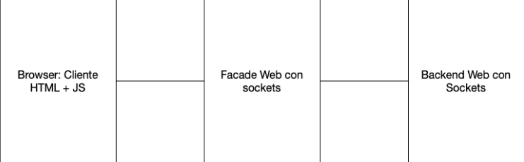
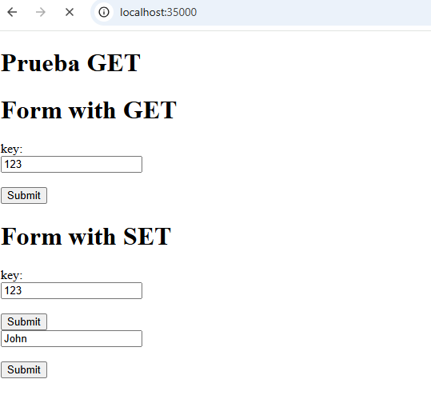
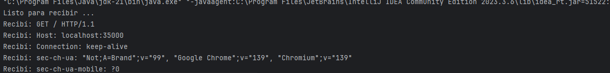
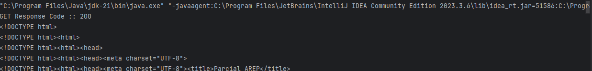

# Arep_Parcial1
## David Santiago Espinosa

---
El programa  consiste en un servidor http Sencillo en java el cual permite hacer request de tipo GET y SET haciendo uso de una id y un valor

Utiliza una arquitectura en capas donde se tiene un cliente el cual es  un programa html con JavaScript, se comunica con el servidor fachada que procesa la solicitus y finalmente dese el httpServer se brinda la data



## Implementacion cliente.html



## Implementacion HTTPServer


## Implementacion FacadeServer (GET)



# Como usar
Para esto estamos usando maven
```bash
java -cp target/classes src.main.java.HttpServer
```
```bash
java -cp target/classes src.main.java.FacadeServer
```